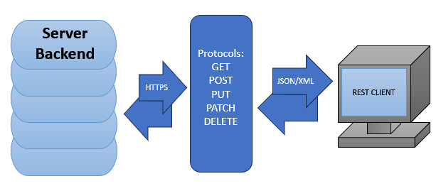
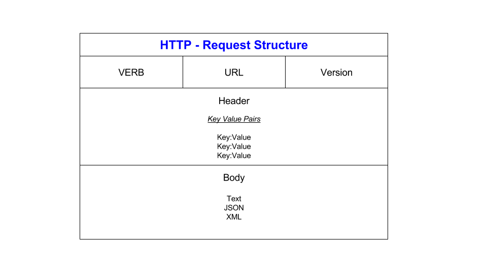

## What are APIs, how are they used and why are they so popular?
***A***pplication ***P***rogramming ***I***nterfaces. These are a means for completely different programs/software/scripts/etc to communicate with eachother. Formatting, and handling this data needs to adhere to specific guidelines and utilise specific protocols for the applications communicating with eachother to understand.

## Diagram to showcase data transfer process in API communication

## What is a rest API and what makes an API restful?
API that follows REST guidelines. These are...

- Uniform interface: All API requests should look the same, and same data should belong to one URI only.
- Client-server decoupling: Client and server applications must be entirely dependent and not interact outside of requests.
- Statelessness: Each request needs to include all the information required to process the request, with no reliance on server side sessions or stored data.
- Cacheability: Resources should be casheable, for both server and client, with the server response clarifying if cashing is permitted.
- Layered system architecture: Needs calls and responses to go through different layers, so server or client can't tell if it's communicating with intermediary or end application.
- CRUD operations: Requests need to be able to read, create, update and delete from the server.
- Representation data flow: Client and server need to be able to read format used by the API and the resource needs to be completely delivered before anything else happens, and that the recipient has received the data.

## What is HTTP, and what is HTTPS
Stands for ***H***yper***T***ext ***T***ransfer ***P***rotocol. This is an application layer protocol for transferring information across a network, usually containing hyperlinks to other information. HTTPS is the same as HTTP, but encrypted for security reasons, as the ***S*** stands for ***S***ecure.

## HTTP request structure:

This is the request structure for HTTP. 

The ***verb*** is the protocol being used for the request (eg. GET, POST, etc...). These will result in a different response status number received back from the server, and are handled slightly differently so it is important to get them correct.

The ***URL*** is the address associated with the resource location the request is being sent to. Provide the wrong URL and you will make a request to the wrong server/location or possibly not even receive a response depending on the URL.

The ***version*** is the HTML version, so the server knows what version of HTML it should consider when handling the request.

The ***headers*** is the information the client sends about the nature of the request, and any information needed to tailor the request formatting specific to the client. Protocols do this automatically but additional headers can be sent.

The ***body*** is the data transmitted to the server for the request, for example username and password when logging into a website. Can be in JSON/XML/or plain text.

## HTTP response structure:

Gives ***response code*** which tells you response from the server, with code specific to request protocol.

***Body*** is the data in the response that we requested.

## What are the 5 HTTP verbs and what do they do?

GET
- Used for retrieving information from the server.
- For example, get requests are used to get specific data from the server like an email associated 

POST
- Used to create new data.

PUT
- Used mainly to update data.
- Need to provide entire contents of the key/value being updated.

PATCH
- Used to modify data.
- Only need to provide the changes being made.

DELETE
- Used to delete data.

## What is statelessness?
Calls can be made independent to each other, with no reliance on server side sessions or stored data.

This means the server ***DOES NOT*** store information about the client's request!

## What is caching?
Allows storage of frequently used data for future use without requiring a new call.