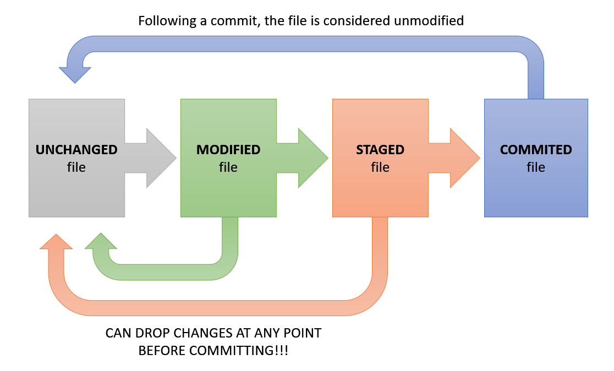

# What is Git?

Git is a version control system (VCS).

This is a system that lets you change what version of
a project you are working on, by storing versions in a
database and going back to them when desired.

The most popular VCS is ***Git***. However, the features of Git 
have expanded beyond the original concept of version control.

Older VCSs would use ***delta-based version control***, which 
save the entire database of files, and all changes to the 
files in that database.

Git, however, uses ***snapshot based version control***, which
instead takes a snapshot of the files at the time, and any 
files that are unchanged are instead referenced from older
versions of the files, saving on file size.

Three states altered files can be in when using Git.
- Modified: File is changed, but this is not reported to Git.
- Staged: Reported to Git which file(s) have been changed and how.
- Committed: Changes are saved to Git as a snapshot.

Workflow:

Or, you can discard any modifications you do not want to make.

Git is purely local, and changes are tracked with checksums.
This allows Git to make sure any intentional or accidental 
changes are known about to ensure proper tracking of versions,
as any changes to a file will change it's SHA-1 hash.

Data is only really added to the Git database, with some exceptions.
This means you can experiment without worrying about lost data,
provided you're diligent with snapshotting.

Git = Git VCS that can be used purely locally.

GitHub = Online repository of your files, using Git to version control them.

## Commands

- ls
    - shows files
    - -a will show all hidden files too
- git init
    - starts a git project
- git status
    - shows staged files
- git add .
    - stages all files
    - the '.' can be replaced with filenames to add specific files
- got commit -m "<message>"
    - commits staged changes
    - requires a commit message
- .gitignore
    - creates file that contains list of files for git to ignore
- git log
    - log of git project history